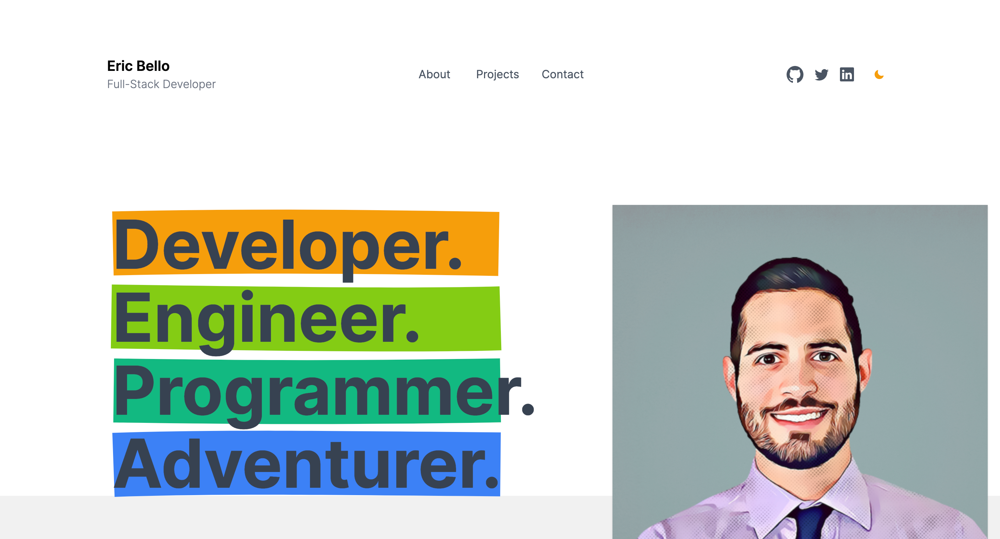

# My Developer Portfolio

A simple and minimalistic website showcasing my skills and projects as a developer.

# Features

- Responsive layout, works well on both Mobile and Desktop
- Dark mode support. Click buttons to toggle dark mode and light mode.
- Clear React components and Tailwind styling.

# Tech Stack

The website is built in my favorite Tech Stack and deployed on [Vercel](https://vercel.com)

- [Next.js](https://nextjs.org) for building React Components.
- [tailwindcss](https://tailwindcss.com) for styling.
- [React Rough Notation](https://roughnotation.com) for Hero section highlighting.
- [Vercel](https://vercel.com) for deployments and CI/CD.